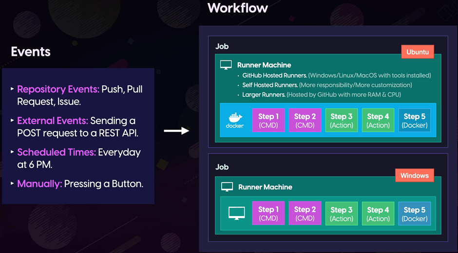

## GitHub Actions

GitHub Actions is a tool designed to automate software development workflows. Workflows are configurable automated processes that perform various tasks such as testing, publishing a package, deploying applications, notifying users, and opening issues. A workflow can consist of multiple jobs, and each job can have a series of steps.

### Key Components of GitHub Actions:

- **Workflows:** Workflows are triggered by events and define the automated processes to be executed. They can contain multiple jobs, each with its own set of steps.
  
- **Events:** Events trigger workflows. These events can include push events, pull request events, issue events, scheduled events, and more.
  
- **Jobs:** Jobs are the individual units of work within a workflow. They can run in parallel or sequentially, depending on the configuration.
  
- **Steps:** Steps are the individual tasks that make up a job. They can include commands, actions, and the execution of Docker containers.
  
- **Actions:** Actions are custom applications that perform complex but frequently repeated tasks. They can be used within workflows to automate various processes.

  
- **YAML:** Workflows are written in YAML (YAML Ain't Markup Language), a human-readable data serialization format. YAML files define the structure of workflows, including events, jobs, and steps. Here's a quick [YAML reference](https://learnxinyminutes.com/docs/yaml/) for more information.

GitHub Actions provides a flexible and powerful platform for automating software development workflows, helping teams streamline their development processes and improve productivity.
