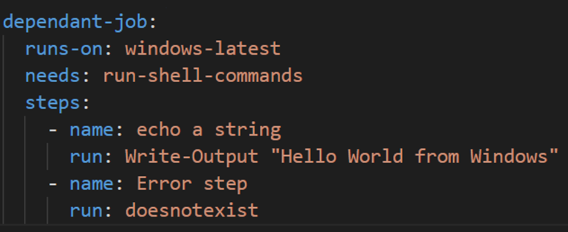
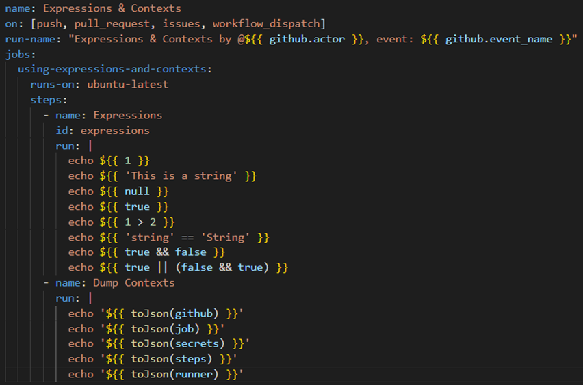
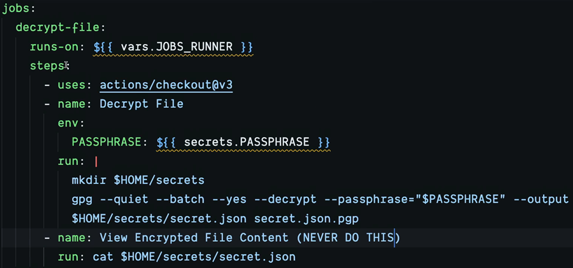

# GitHub Actions

GitHub Actions is a tool designed to automate software development workflows. Workflows are configurable automated processes that perform various tasks such as testing, publishing a package, deploying applications, notifying users, and opening issues. A workflow can consist of multiple jobs, and each job can have a series of steps. [Refer To Documentation when creating pipelines](https://docs.github.com/en/actions)

## Section 1: Intro & Basic Concepts

### Key Components of GitHub Actions:

- **Workflows:** Workflows are triggered by events and define the automated processes to be executed. They can contain multiple jobs, each with its own set of steps.
  
- **Events:** Events trigger workflows. These events can include push events, pull request events, issue events, scheduled events, and more.
  
- **Jobs:** Jobs are the individual units of work within a workflow. They can run in parallel or sequentially, depending on the configuration.
  
- **Steps:** Steps are the individual tasks that make up a job. They can include commands, actions, and the execution of Docker containers.
  
- **Actions:** Actions are custom applications that perform complex but frequently repeated tasks. They can be used within workflows to automate various processes.

  
- **YAML:** Workflows are written in YAML (YAML Ain't Markup Language), a human-readable data serialization format. YAML files define the structure of workflows, including events, jobs, and steps. Here's a quick [YAML reference](https://learnxinyminutes.com/docs/yaml/) for more information.

GitHub Actions provides a flexible and powerful platform for automating software development workflows, helping teams streamline their development processes and improve productivity.

### Creating a Workflow

Workflows in GitHub Actions must be created in the `.github/workflows/` directory. A workflow file should include the following components:

- **Name:** A descriptive name for the workflow.
- **On:** An event trigger that specifies when the workflow should be executed.
- **Jobs:** The main section of the workflow file, containing the steps to be executed.
  

1. Parallel Jobs and Dependencies

Jobs can be configured to run in parallel by simply adding additional job definitions to the workflow file. To run a job as a dependent job, you need to use the `needs` block to specify dependencies between jobs.

2. Disabling Workflows

You can disable a workflow on GitHub to prevent it from running at all. This can be useful when you need to temporarily suspend a workflow.

after clicking on a workflow, you have an option to re-run all or the failed jobs, you can also cancel a job whilst it is running.

### Debugging

GitHub Actions provides several debugging features:
- Searching and downloading logs.
- Clicking on the line of an error to generate a URL that directly links to the error line.
- Enabling debug logging by setting specific environment variables (`ACTIONS_STEP_DEBUG=true` and `ACTIONS_RUNNER_DEBUG=true`).
  
  

You can also skip a workflow by including specific keywords in square brackets in the commit message which are [ skip ci, ci skip, no ci, skip actions, actions skip ].

### Workflow Commands

You can use workflow commands to display messages, group logs, and mask sensitive information. Here are some examples:
- Displaying an error message: `echo "::error::<error-message-you-want-to-display>"`
  
- Displaying debug, notice, and warning messages with the similar conventation as error.
  
- Grouping logs with `::group::` and `::endgroup::`.
  
- Masking variables with `::add-mask::<variable_name>` to prevent them from being displayed in standard output.
  

### Shells and Working Directory

- You can set the default shell for all jobs by `defaults: run: shell: bash` at the top of the workflow file, you can also do this for working directory default `defaults: run: working-directory: /set_the_workding_directory_path/`
 
- Additionally, you can override defaults at the job level,
 
- and step level. 

### Downloading Repositories into Runner Machines

- Manually downloading repositories into runner machines can be done using a specific workflow configuration. 

- However, it's much simpler to achieve this using actions, which are reusable units of code. 
  
- Actions can be referenced using the `uses` syntax, and you can reference the output of an action by setting an `id` for the action step and referencing it with `${{ steps.<id>.outputs.<output_name> }}`.
- 

# Section 2: Events that Trigger Workflows

## Repository Events

1. Events can be configured using the `on` block, with options such as `[push, pull_requests, issues]`.
   - You can specify the activity type with `types` after the event, determining which activity of that event will trigger the workflow.
     
   - For forked pull requests, workflows can be approved. In private repositories, enable workflow fork pull requests in repo settings under `Settings` > `Actions`   
    ,
      and specify who needs approval in GitHub repo settings.
    

2. Use `pull_request_target` event to run in the context of the base of the pull request rather than in the context of the merge commit. This allows actions like labeling or commenting on pull requests from forks. Avoid using this event if you need to build or run code from the pull request.

3. Trigger another workflow with `workflow_run`, useful for running dependent workflows. Specify the workflows to trigger under `workflows: [<name of workflow1>, <name of workflow2>]`.
   

4. Filter workflow runs on specific branches, tags, and paths by adding `branches` and specifying branches. Note: the order is important, and if you want to exclude a branch, it should be placed at the end. All filters set must be matched for the workflow to run.
   

5. Use the Workflow Dispatch event to enable manual triggering, displaying a button on GitHub for manual triggering of the workflow.
   
   - Inputs can be added to the workflow, containing a name, description, type, and default value. 
   
   - They can be referenced in the workflow with `{{ inputs.<name_of_input> }}`.
     
   - Triggered with `gh cli` using `gh workflow run`, and via the GitHub REST API using fine-grained access token and curl commands.
    

6. `repository_dispatch` can be used to trigger workflows based on external events such as a webhook.
   

7. Events can be scheduled to run at specified intervals, such as daily, every 10 minutes, or every hour.
   

# Section 3: Expressions, Contexts, Functions, Environment Variables & Secrets

1. **Expressions**:
   - Expressions are used to programmatically set environment variables in workflow files and access contexts. They can be any combination of literal values, references to a context, or functions. Expressions are in the format `${{ <value> }}`.

2. **Contexts**:
   - Contexts provide information about workflow runs, variables, runner environments, jobs, and steps. Each context is an object containing properties, which can be strings or other objects. They're accessed using the expression syntax `${{ <context> }}`.
  

3. **Conditional Clauses**:
   - Workflows can use conditional clauses like `if`.
     
     - `contains(search, item)`: Returns true if `search` contains `item`. If `search` is an array, it returns true if `item` is an element in the array. If `search` is a string, it returns true if `item` is a substring of `search`. This function is not case-sensitive and casts values to a string.
      
     - The `*` syntax applies a filter to select matching items in a collection.
       For example, consider an array of objects named fruits. 
        
       The filter fruits.*.name returns the array [ "apple", "orange", "pear" ].

4. **Status Check Functions**:
   - These functions are used as expressions in `if` conditionals and include `[success, always, cancelled, failure]` with conditions.

5. **Default Environment Variables**:
   - A list of default variables can be found in the [documentation](https://docs.github.com/en/actions/learn-github-actions/variables#default-environment-variables).
     - In `if` conditionals, use the context and not environment variables because the conditional is processed by GitHub Actions before the workflow runs on the runner machine so any environment variables from the runner machine won’t work here.
       
     - custom environment variables can be configured with `env:` on three levels: workflow, job and step - depending on where you place the `env:` in the workflow file, the env set in lower levels override those above it.

6. **Setting Environment Variables**:
   - During workflow execution, environment variables can be set by running `echo "{environment_variable_name}={value}" >> "$GITHUB_ENV"`.
    
     - For multiline strings, use a delimiter.
     - Syntax is like this:
      
     - An example will look like this:
      
      And the output is this.
      
    - Note: the delimiter should be unique and uncommon so that it doesn’t accidently get fetched in the content of the value and end up giving an incomplete value because it wasn’t parsed properly

7. **Configuration Variab**:
   - These variables can be used to set secrets/variables at the repo or organization level. They can be configured on the GitHub UI, and environments will override those above them (environment > repo > organization).
    

8. **Secrets**:
   - Secrets are limited to 48KB. For larger secrets, save the encrypted file to the repository, set a passphrase to decrypt the file as a secret, and use it when running a command to decrypt the file.
    

9. **Default GITHUB_TOKEN Secret**:
   - By default, GitHub Actions uses a randomly generated `GITHUB_TOKEN` secret authentication token for the duration of the workflow on the runner machine. However, it's recommended to edit permissions in your workflow to only give the permissions needed for the workflow to run.
    

