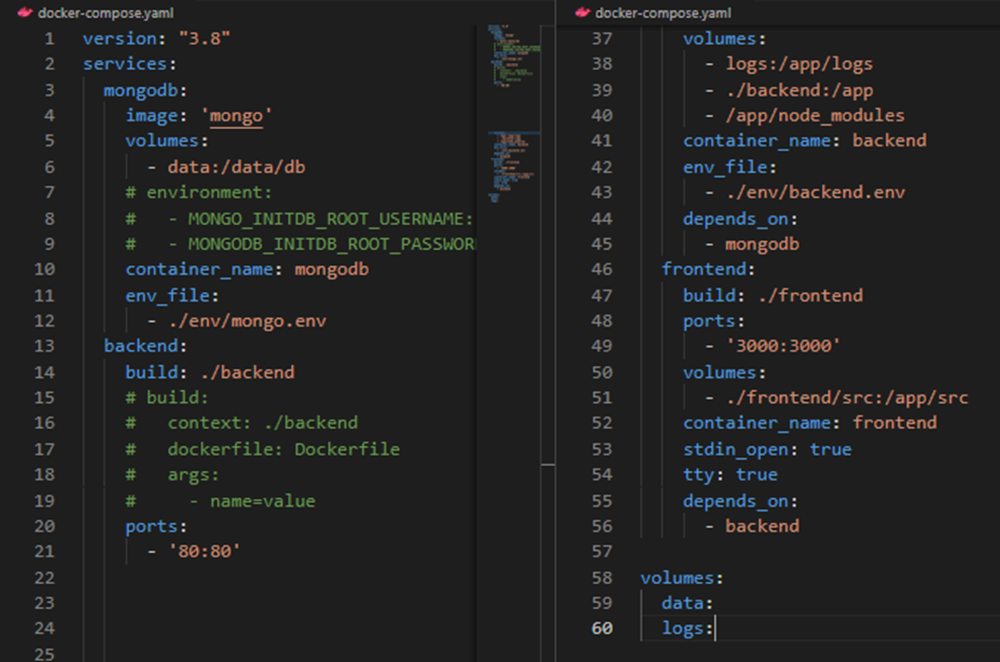

# Docker Notes

These notes cover important topics related to Docker that I have identified. I have included examples and explanations to help me better understand these concepts and fill any gaps in my knowledge. These notes will serve as a valuable resource for me to review.

## Section 3

   **Useful Commands:**
      - `docker ps` # Lists all running Docker containers.
      - `docker run -p 38282:8080 -d kodekloud/simple-webapp:blue` # Runs a container from the specified image, mapping port 38282 on the host to 8080 in the container, and detaches it to run in the background.
      
      - `docker run <Image>:<Tag/Version>` # Runs a container from the specified image and version tag (defaults to latest if not specified).
      - `docker push and docker pull` # Pushes a local image to a Docker registry or pulls an image from it.
      
      - `docker container rm/stop/start/prune <container_name>` # Removes, stops, starts, or cleans up containers by name.
      - `docker image build/ls/prune/rm <image_name>` # Builds, lists, removes, or cleans up Docker images.
      - `docker attach <Running_container_id>` # Connects to the terminal of a running container.
      - `docker inspect <container_name>` # Displays detailed information about a container.
      - `docker build -t <tag/name> .` Builds a Docker image from a Dockerfile in the current directory and tags it with a name.
      - For environment variables add `-e ENVIRONMENT_VARIABLE=value`

## Section 4

1. **Command CMD:**
   - Add in Dockerfile like `CMD command param1` or CMD["Command","param1"]
   - CMD ["sleep","5"] is correct, CMD["sleep 5"] is incorrect

2. **Entrypoint:**
   - The ENTRYPOINT in a Dockerfile specifies the default command that runs when a container starts. It sets the main process that the container will execute, and unlike CMD, it cannot be easily overridden by passing arguments at runtime.
   - ENTRYPOINT ["executable", "param1", "param2"] is correct, In this example, the container will always run executable param1 param2 on startup.

## Section 5

   1. **Multiple container stack:**
      - Use `docker run --link container_name:name_on_host_code` to link two containers together e.g. `docker run --link redis:redis`, docker link will soon be deprecated.

   2. **Docker Compose:**
      - Use docker compose files to specify name, image and other configurations of all required containers on one yaml file.
      - Version 2 allows you to create virutal networks and connects the containers.
      - Version 3 allows for swarm networking.
      

## Section 7

   1. **Docker Engine components:**
      - Docker Daemon: Manages Docker objects like images, containers, volumes, and networks.
      - REST API Server: Provides an API interface for interacting with the Docker daemon.
      - Docker CLI: Command-line interface to interact with Docker; uses REST API to communicate with the daemon.
  
   2. **Remote Docker Control:**
      - CLI can manage a Docker engine on a remote host using the -H option.

   3. **Containerization Mechanism:**
      - Namespaces: Used for isolating processes, ensuring each container has its own process ID namespace.
      - Process Isolation: Containers think they have independent process IDs, but they share the underlying host's resources.

   4. **Resource Management:**
      - Control Groups (cgroups): Limit CPU and memory usage for each container using options like --cpus and --memory.

   5. **Docker Storage and File Systems:**
      - Docker stores data on the local file system under `/var/lib/docker` with subfolders like `aufs`, `containers`, `image`, `volumes`, etc.
      - Each subfolder contains specific data:
        - **containers:** Stores data related to running containers.
        - **image:** Stores Docker images.
        - **volumes:** Stores data for Docker volumes.

   6. **Docker Layered Architecture:**
      - **Layered Images:** Docker images are built in layers, with each layer representing a change from the previous one (e.g., base OS, installed packages, source code, etc.).
      - **Layer Reuse:** Docker reuses layers from previous builds to save disk space and speed up the build process.

   7. **Image and Container Layers:**
      - **Read-Only Image Layers:** Image layers are read-only and cannot be modified after creation.
      - **Writable Container Layer:** When a container is run, a new writable layer is added on top of the image layers for any changes made by the container.
      - **Copy-on-Write:** If a file in the image layer needs modification, Docker creates a copy in the writable layer, leaving the original image layer unchanged.

   8. **Persistent Data with Volumes:**
      - **Volumes:** Persistent data can be stored in Docker volumes, which survive even if the container is deleted.
      - **Creating Volumes:** Use `docker volume create` to create a new volume and mount it to a container using `docker run -v`.
      - **Volume Mounting:** Volumes are stored in the `/var/lib/docker/volumes` directory by default.
      - **Bind Mounting:** Allows you to mount a directory from the Docker host into a container using a specific path.

   9. **Volume and Bind Mounting:**
      - **Volume Mounting:** Mounts a Docker-managed volume from the `/var/lib/docker/volumes` directory.
      - **Bind Mounting:** Mounts a directory from any location on the host system into a container.
      - **Preferred Method:** Use the `--mount` option instead of `-v` for more control and clarity (e.g., `--mount type=bind,source=/data/mysql,target=/var/lib/mysql`).

   10. **Storage Drivers:**
      - **Role:** Storage drivers handle the layered architecture, manage the writable layer, and perform operations like copy-on-write.
      - **Common Storage Drivers:** AUFS, BTRFS, ZFS, device-mapper, overlay, and overlay2.
      - **OS-Dependent:** Docker automatically selects the best storage driver based on the operating system (e.g., AUFS for Ubuntu).

   11. **Choosing a Storage Driver:**
      - **Performance and Stability:** Different storage drivers offer varying levels of performance and stability.
      - **Customization:** Choose a storage driver based on your application's needs and the characteristics of your operating system.

