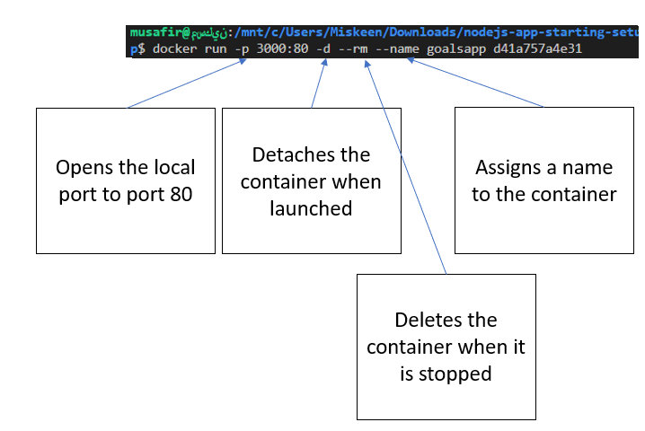
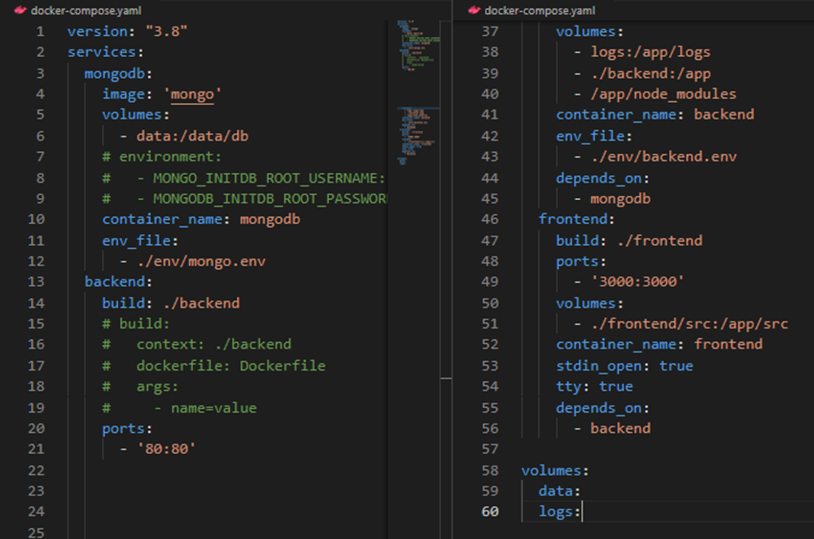

# Docker Notes

These notes cover important topics related to Docker that I have identified. I have included examples and explanations to help me better understand these concepts and fill any gaps in my knowledge. These notes will serve as a valuable resource for me to review.

## Docker for the Absolute Beginner

### Section 3

   **Useful Commands:**
      - `docker ps` # Lists all running Docker containers.
      - `docker run -p 38282:8080 -d kodekloud/simple-webapp:blue` # Runs a container from the specified image, mapping port 38282 on the host to 8080 in the container, and detaches it to run in the background.
      
      - `docker run <Image>:<Tag/Version>` # Runs a container from the specified image and version tag (defaults to latest if not specified).
      - `docker push and docker pull` # Pushes a local image to a Docker registry or pulls an image from it.
      
      - `docker container rm/stop/start/prune <container_name>` # Removes, stops, starts, or cleans up containers by name.
      - `docker image build/ls/prune/rm <image_name>` # Builds, lists, removes, or cleans up Docker images.
      - `docker attach <Running_container_id>` # Connects to the terminal of a running container.
      - `docker inspect <container_name>` # Displays detailed information about a container.
      - `docker build -t <tag/name> .` Builds a Docker image from a Dockerfile in the current directory and tags it with a name.
      - For environment variables add `-e ENVIRONMENT_VARIABLE=value`

### Section 4

1. **Command CMD:**
   - Add in Dockerfile like `CMD command param1` or CMD["Command","param1"]
   - CMD ["sleep","5"] is correct, CMD["sleep 5"] is incorrect

2. **Entrypoint:**
   - The ENTRYPOINT in a Dockerfile specifies the default command that runs when a container starts. It sets the main process that the container will execute, and unlike CMD, it cannot be easily overridden by passing arguments at runtime.
   - ENTRYPOINT ["executable", "param1", "param2"] is correct, In this example, the container will always run executable param1 param2 on startup.

### Section 5

   1. **Multiple container stack:**
      - Use `docker run --link container_name:name_on_host_code` to link two containers together e.g. `docker run --link redis:redis`, docker link will soon be deprecated.

   2. **Docker Compose:**
      - Use docker compose files to specify name, image and other configurations of all required containers on one yaml file.
      - Version 2 allows you to create virutal networks and connects the containers.
      - Version 3 allows for swarm networking.
      

### Section 7

   1. **Docker Engine components:**
      - **Docker Daemon:** Manages Docker objects like images, containers, volumes, and networks.
      - **REST API Server:** Provides an API interface for interacting with the Docker daemon.
      - **Docker CLI:** Command-line interface to interact with Docker; uses REST API to communicate with the daemon.
  
   2. **Remote Docker Control:**
      - CLI can manage a Docker engine on a remote host using the -H option.

   3. **Containerization Mechanism:**
      - **Namespaces:** Used for isolating processes, ensuring each container has its own process ID namespace.
      - **Process Isolation:** Containers think they have independent process IDs, but they share the underlying host's resources.

   4. **Resource Management:**
      - Control Groups (cgroups): Limit CPU and memory usage for each container using options like --cpus and --memory.
     - Use `docker info` to see information about docker system on machine 

#### Docker Storage

   1. **Docker Storage and File Systems:**
      - Docker stores data on the local file system under `/var/lib/docker` with subfolders like `aufs`, `containers`, `image`, `volumes`, etc.
      - Each subfolder contains specific data:
        - **containers:** Stores data related to running containers.
        - **image:** Stores Docker images.
        - **volumes:** Stores data for Docker volumes.

   2. **Docker Layered Architecture:**
      - **Layered Images:** Docker images are built in layers, with each layer representing a change from the previous one (e.g., base OS, installed packages, source code, etc.).
      - **Layer Reuse:** Docker reuses layers from previous builds to save disk space and speed up the build process.

   3. **Image and Container Layers:**
      - **Read-Only Image Layers:** Image layers are read-only and cannot be modified after creation.
      - **Writable Container Layer:** When a container is run, a new writable layer is added on top of the image layers for any changes made by the container.
      - **Copy-on-Write:** If a file in the image layer needs modification, Docker creates a copy in the writable layer, leaving the original image layer unchanged.
      - Use `docker history <Image_id>` to see the history of the creation of an image.

   4. **Persistent Data with Volumes:**
      - **Volumes:** Persistent data can be stored in Docker volumes, which survive even if the container is deleted.
      - **Creating Volumes:** Use `docker volume create` to create a new volume and mount it to a container using `docker run -v`.
      - **Volume Mounting:** Volumes are stored in the `/var/lib/docker/volumes` directory by default.
      - **Bind Mounting:** Allows you to mount a directory from the Docker host into a container using a specific path.

   5. **Volume and Bind Mounting:**
      - **Volume Mounting:** Mounts a Docker-managed volume from the `/var/lib/docker/volumes` directory.
      - **Bind Mounting:** Mounts a directory from any location on the host system into a container. `{host path}:{container path}`
      `docker run -v /opt/data:/var/lib/mysql`
      - **Preferred Method:** Use the `--mount` option instead of `-v` for more control and clarity (e.g., `--mount type=bind,source=/data/mysql,target=/var/lib/mysql`).

   6. **Storage Drivers:**
      - **Role:** Storage drivers handle the layered architecture, manage the writable layer, and perform operations like copy-on-write.
      - **Common Storage Drivers:** AUFS, BTRFS, ZFS, device-mapper, overlay, and overlay2.
      - **OS-Dependent:** Docker automatically selects the best storage driver based on the operating system (e.g., AUFS for Ubuntu).

   7. **Choosing a Storage Driver:**
      - **Performance and Stability:** Different storage drivers offer varying levels of performance and stability.
      - **Customization:** Choose a storage driver based on your application's needs and the characteristics of your operating system.

#### Docker Networking

   1. **Docker Networks:**
    - **Default Networks:** Docker automatically creates three networks on installation: `bridge`, `none`, and `host`.
    - **Bridge Network:** The default private internal network where containers receive an internal IP address (usually in the 172.17.x.x range). Containers on this network can communicate with each other using internal IPs.
    - **Host Network:** Removes network isolation, allowing containers to share the host's network directly. This eliminates the need for port mapping but restricts running multiple containers on the same port.
    - **None Network:** Containers are isolated and do not connect to any network, including other containers or external networks.

   2. **Custom Networks:**
    - **Isolated Networks:** You can create custom bridge networks to isolate groups of containers on different internal networks using `docker network create --driver bridge --subnet <subnet> <network_name>`.
    - **Listing Networks:** Use `docker network ls` to list all networks on the Docker host.

   3. **Container Network Settings:**
    - **Inspect Network Settings:** View a container’s network details, including its IP address and network type, using `docker inspect <container_id_or_name>`.
    - **DNS Resolution:** Docker has a built-in DNS server (at 127.0.0.11) that allows containers to resolve each other by name, ensuring consistent communication regardless of IP address changes.

   4. **Container Communication:**
    - **Using Container Names:** Containers can reach each other by name rather than IP, which is ideal for consistent networking, especially after reboots.
    - **Virtual Ethernet Pairs:** Docker uses virtual Ethernet pairs to connect containers and manage network isolation through network namespaces.

   5. **Networking Technology:**
    - **Network Namespaces:** Docker creates separate namespaces for each container to ensure isolation.
    - Run a container named alpine-2 using the alpine image and attach it to the none network. Answer : `docker run -d --name alpine-2 --network none alpine`

## Advanced Docker

### AD Section 3

#### Docker Swarm

   1. **Basics**
      - **Docker Swarm:** Native clustering and orchestration tool for Docker containers.
      - **Cluster Components:**
        - **Manager Nodes:** Manage cluster, distribute tasks, maintain state.
        - **Worker Nodes:** Run tasks assigned by managers.

   2. **Setup**
      - **Initialize Swarm:**

        ```bash
        docker swarm init --advertise-addr <IP>
        ```

      - **Add Worker to Swarm:**

        ```bash
        docker swarm join --token <TOKEN> <MANAGER-IP>:2377
        ```

      - **Add Manager to Swarm:**

        ```bash
        docker swarm join-token manager
        ```

   3. **Management**
      - **List Nodes:**

        ```bash
        docker node ls
        ```

      - **Promote Worker to Manager:**

        ```bash
        docker node promote <NODE-ID>
        ```

      - **Remove Node:**

        ```bash
        docker node rm <NODE-ID>
        ```

      - **Drain Node (Disable Tasks):**

        ```bash
        docker node update --availability drain <NODE-ID>
        ```

   4. **Fault Tolerance**
      - **Quorum:** Majority of managers needed for decision-making.
      - **Best Practice:** Use an odd number of manager nodes (3, 5, 7) for better fault tolerance.
      - **Recover from Failure:**
        - **Bring Node Back:** Restart failed managers to regain quorum.
        - **Force New Cluster (if necessary):**

          ```bash
          docker swarm init --force-new-cluster --advertise-addr <IP>
          ```

   5. **Raft Consensus**
      - **Leader Election:** Leader chosen among managers via Raft algorithm.
      - **Data Consistency:** All changes require consensus from the majority of managers.

   6. **Maintenance**
      - **Remove Down Node:**

        ```bash
        docker node rm <NODE-ID>
        ```

      - **View Logs:**

        ```bash
        docker logs <CONTAINER-ID>
        ```

### AD Section 4

#### Docker service

1. **Introduction**
   - **Docker Services**: Key component of Docker Swarm orchestration to run one or more instances of an application across a swarm cluster.

2. **Creating Services**
   - **Basic Service Creation**:

     ```bash
     docker service create --name <service-name> <image>
     ```

   - **Replicated Services**: Run multiple instances of an application.

     ```bash
     docker service create --name <service-name> --replicas 3 <image>
     ```

3. **Service Commands**
   - **List Services**:

     ```bash
     docker service ls
     ```

   - **Inspect Service**:

     ```bash
     docker service inspect <service-name>
     ```

   - **List Service Tasks**:

     ```bash
     docker service ps <service-name>
     ```

   - **Scale Service**:

     ```bash
     docker service scale <service-name>=<replica-count>
     ```

4. **Updating Services**
   - **Update Service** (e.g., Publish Port):

     ```bash
     docker service update --publish-add <port>:<port> <service-name>
     ```

5. **Service Types**
   - **Replicated Services**: Specific number of replicas across the cluster.
   - **Global Services**: One instance of the service runs on every node.

     ```bash
     docker service create --mode global <image>
     ```

6. **Failure Handling**
   - **Automatic Rescheduling**: If a container fails, Docker Swarm redeploys the container on another available node to meet the specified replica count.

7. **Draining Nodes**
   - **Prevent Node from Running Containers**:

     ```bash
     docker node update --availability drain <node-name>
     ```

8. **Service Name**
   - If no name is specified, Docker assigns a random name.
   - For replicated services, Docker appends a number to the container name to differentiate instances.

## AD Section 5

### Docker Stacks

1. **Introduction:**
   Allows you to deploy and manage multi-container applications using a single configuration file.

2. **Docker Compose vs. Docker Stack**
   - **Docker Compose:**
     - Used for defining and running multi-container Docker applications.
     - Typically used with `docker-compose up` for single-host deployments.
   - **Docker Stack:**
     - Extends Docker Compose functionality to multi-node Swarm clusters.
     - Deploys a complete application stack with `docker stack deploy`.

3. **Docker Compose File**
   - **Format:** YAML
   - **Version:** Use version 3 for Docker Swarm configurations.
   - **Key Property:** `deploy`
     - **Replicas:** Number of service instances.
     - **Placement:** Placement constraints (e.g., node hostname or role).
     - **Resources:** Limits for CPU and memory.

4. **Example Stack Configuration**

   ```yaml
   version: '3'
   services:
     redis:
       image: redis
       deploy:
         replicas: 1
         resources:
           limits:
             cpus: "0.5"
             memory: 50M
     postgres:
       image: postgres
       deploy:
         replicas: 1
         placement:
           constraints:
             - node.role == manager
     vote:
       image: votingapp/vote
       deploy:
         replicas: 2
     worker:
       image: votingapp/worker
       deploy:
         replicas: 1
     result:
       image: votingapp/result
       deploy:
         replicas: 1
   ```
