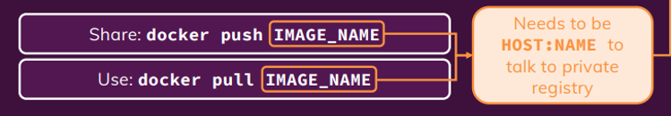

# Docker Notes

These notes cover important topics related to Docker that I have identified. I have included examples and explanations to help me better understand these concepts and fill any gaps in my knowledge. These notes will serve as a valuable resource for me to review.

## Section 3

   **Useful Commands**
      - `docker ps` # Lists all running Docker containers.
      - `docker run -p 38282:8080 -d kodekloud/simple-webapp:blue` # Runs a container from the specified image, mapping port 38282 on the host to 8080 in the container, and detaches it to run in the background.
      
      - `docker run <Image>:<Tag/Version>` # Runs a container from the specified image and version tag (defaults to latest if not specified).
      - `docker push and docker pull` # Pushes a local image to a Docker registry or pulls an image from it.
      
      - `docker container rm/stop/start/prune <container_name>` # Removes, stops, starts, or cleans up containers by name.
      - `docker image build/ls/prune/rm <image_name>` # Builds, lists, removes, or cleans up Docker images.
      - `docker attach <Running_container_id>` # Connects to the terminal of a running container.
      - `docker inspect <container_name>` # Displays detailed information about a container.
      - `docker build -t <tag/name> .` Builds a Docker image from a Dockerfile in the current directory and tags it with a name.
      - For environment variables add `-e ENVIRONMENT_VARIABLE=value`

## Section 4
1. **Command CMD**
   - Add in Dockerfile like `CMD command param1` or CMD["Command","param1"]
   - CMD ["sleep","5"] is correct, CMD["sleep 5"] is incorrect

2. **Entrypoint**
   - The ENTRYPOINT in a Dockerfile specifies the default command that runs when a container starts. It sets the main process that the container will execute, and unlike CMD, it cannot be easily overridden by passing arguments at runtime.
   - ENTRYPOINT ["executable", "param1", "param2"] is correct, In this example, the container will always run executable param1 param2 on startup.

## Section 5
   1. **Multiple container stack**
      - use `docker run --link container_name:name_on_host_code` to link two containers together e.g. `docker run --link redis:redis`, docker link will soon be deprecated.
      - 