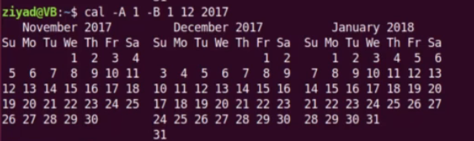
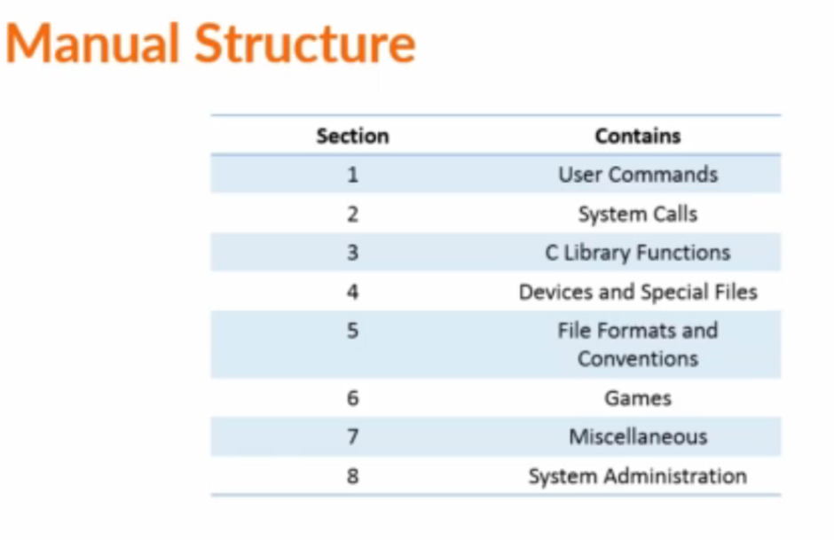
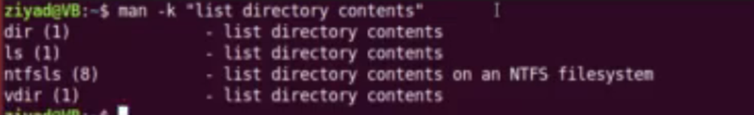
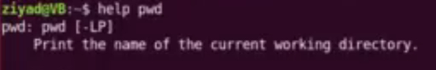
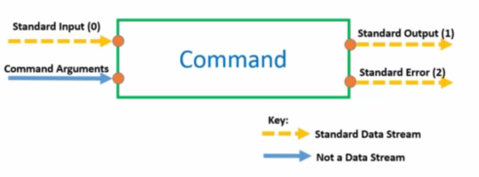
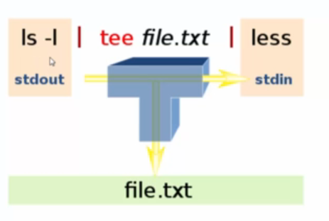
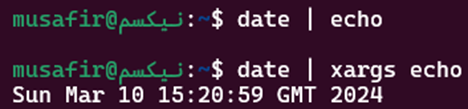
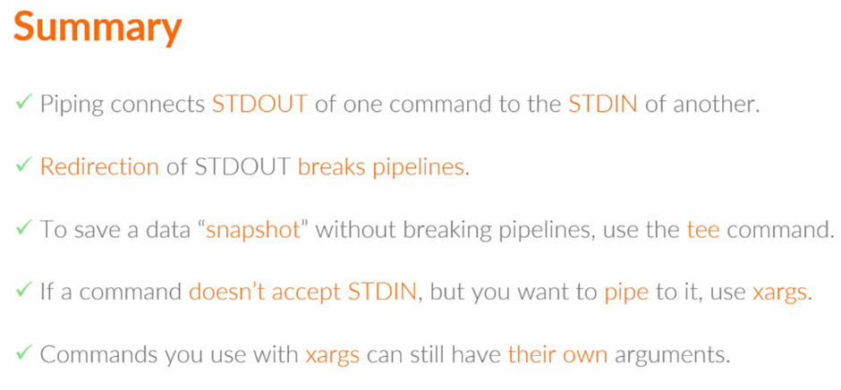
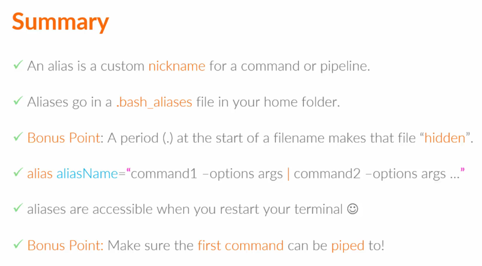

# Linux Fundamental Knowledge

## `$PATH` and Command Paths
- `$PATH` is used to find the path of commands.
- Use `which <command>` to determine the path of a command.

## Command Format
- Format: `command <-options> <inputs>`.
- Some options have their own input.

- Some options need a `=` to be connected to their inputs.

## Manual Pages

- Mostly use sections 1, 5, and 8 of the manual structure.
- Use `man -k <command>` to search for the manual for a specific command.
- In a manual page, `[]` denotes optional options, `<>` denotes mandatory options, `[ | ]` denotes options inside that can't be used together, and `...` denotes multiple inputs.
- Use `man -k "<text>"` to find new commands.

- Some commands don’t have a manual page so use `help` instead

## Command Input and Output

- Direct standard output (1) with `>`.
- Redirect standard error (2) with `2>`.
- Redirection `>` overwrites current contents, `>>` appends to content.

## Piping
- Use the Tee command to allow data flow in two directions.

- Xargs converts pipe data into command line arguments.

## File Management
- A dot `.` makes a file hidden when added to the front.
- `.bash_aliases` file for creating aliases in Linux.
- Make aliases with `alias <alias_name>='<command_and_arg>'`.

## Useful Linux Commands
1. `pwd`: Print working directory.
2. `cd`: Change directory.
3. `ls`: List files.
4. `mkdir`: Make directory.
5. `rm`: Remove files or directories.
6. `touch`: Create empty files.
7. `nano`: Text editor. exit=^x    save=y
8. `cat`: Concatenate and display files.
9. `cp`: Copy files or directories.
10. `whoami`: Print current user.
11. `id`: Print user identity.
12. `hostname`: Print system hostname.
13. `uptime`: Print system uptime.
14. `history`: Command history.
15. `tail`: Output the last part of files.
16. `head`: Output the first part of files.
17. `sudo su`: Switch user.
18. `useradd`: Add a new user.
19. `passwd`: Change user password.
20. `grep`: Search text.
21. `userdel`: Delete a user.
22. `groupadd`: Add a new group.
23. `groupmod`: Modify group attributes.
24. `groupdel`: Delete a group.
25. `usermod`: Modify user attributes. (-a -G) (-aG) [this and gpasswd do the same thing]
26. `gpasswd`: Modify group password. (-a) adds users to groups (-d) deletes (-M) set members separate the names with a comma (-A) set admin separate the names with a comma.
27. `mv`: Move or rename files.
28. `more`: Display file content page by page.
29. `less`: Display file content page by page (backward).
30. `hash`: Show history of programs and commands.
31. `cksum`: Verify file integrity.
32. `find`: Search for files.
33. `diff`: Compare files.
34. `ln`: Create file links.
35. `tar`: Archive files.
36. `gzip`: Compress files.
37. `zip`: Compress files (ZIP format).
38. `unzip`: Decompress files (ZIP format).
39. `chmod`: Change file permissions.
40. `chown`: Change file ownership.

## I/O Redirection Operators
- `>`: Sends output to a file.
- `<`: Receives input for a command from a file.
- `|`: Redirects output as input to another command.
- `>>`: Appends output to a file.
- `2>`: Redirects errors to a file.
- `2>>`: Appends errors to a file.

## From OverTheWire
- Example: `find /path/to/search -type f -size 1033c ! -executable -exec ls -lh {} +`.

## Other Useful Commands
- `uniq`: Identify duplicates in a file.
- `tr`: Translate or delete characters.
- `xxd -r`: Revert a hexdump file.

## Common Decompression Methods
- `gzip -d`: Decompress files with .gz extension.
- `bzip2 -d`: Decompress files with .bz extension.
- `tar -xf`: Extract files with .tar extension.

## Netcat (nc) Command
- Used for reading from and writing to network connections using TCP or UDP protocols.
- Example: `nc localhost 30000`.