# Linux Fundamental Knowledge

- [Linux Fundamental Knowledge](#linux-fundamental-knowledge)
  - [`$PATH` and Command Paths](#path-and-command-paths)
  - [Command Format](#command-format)
  - [Manual Pages](#manual-pages)
  - [Command Input and Output](#command-input-and-output)
  - [Piping](#piping)
  - [File Management](#file-management)
  - [Useful Linux Commands](#useful-linux-commands)
  - [I/O Redirection Operators](#io-redirection-operators)
  - [From OverTheWire](#from-overthewire)


## `$PATH` and Command Paths
- `$PATH` is used to find the path of commands.
- Use `which <command>` to determine the path of a command.

## Command Format
- Format: `command <-options> <inputs>`.
- Some options have their own input.
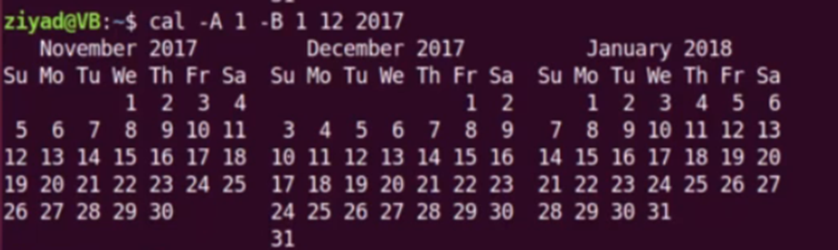
- Some options need a `=` to be connected to their inputs.

## Manual Pages
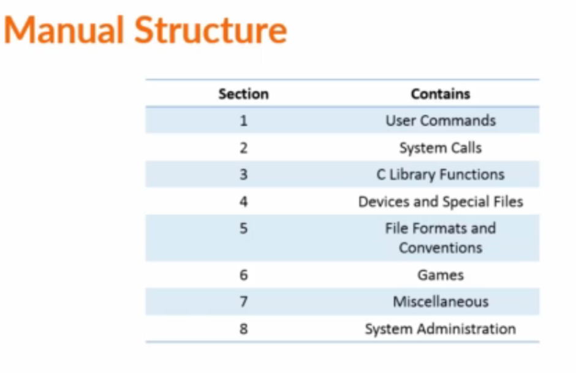
- Mostly use sections 1, 5, and 8 of the manual structure.
- Use `man -k <command>` to search for the manual for a specific command.
- In a manual page, `[]` denotes optional options, `<>` denotes mandatory options, `[ | ]` denotes options inside that can't be used together, and `...` denotes multiple inputs.
- Use `man -k "<text>"` to find new commands.
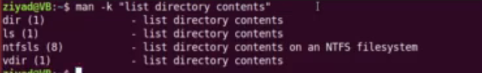
- Some commands don’t have a manual page so use `help` instead
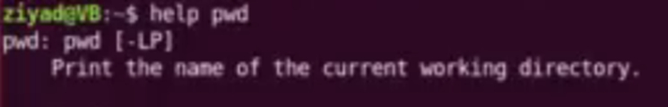

## Command Input and Output
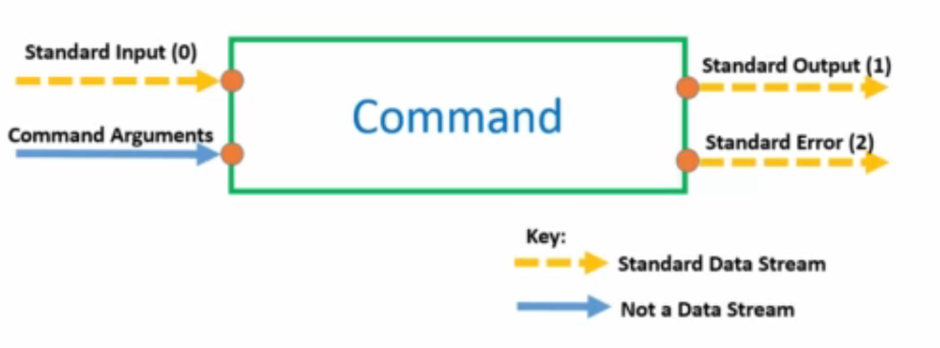
- Direct standard output (1) with `>`.
- Redirect standard error (2) with `2>`.
- Redirection `>` overwrites current contents, `>>` appends to content.

## Piping
- Use the Tee command to allow data flow in two directions.
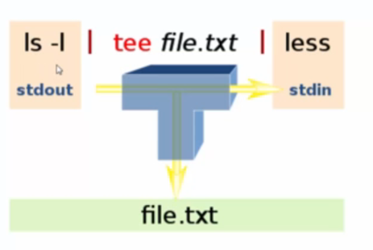
- Xargs converts pipe data into command line arguments.
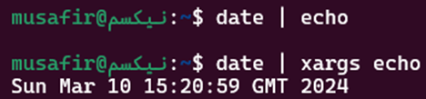
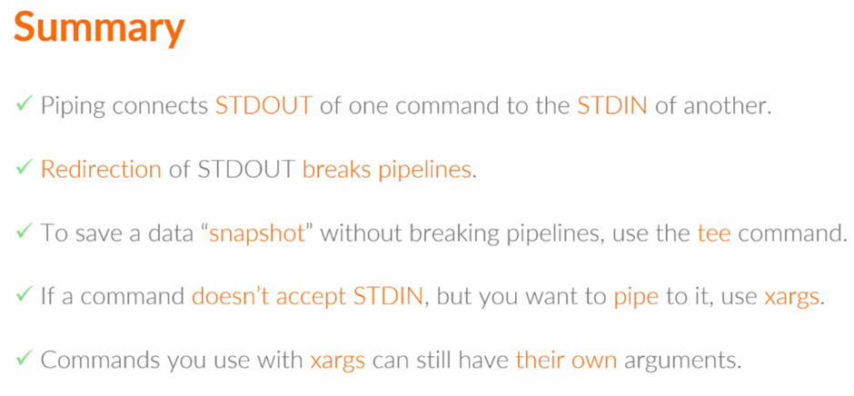

## File Management
- A dot `.` makes a file hidden when added to the front.
- `.bash_aliases` file for creating aliases in Linux.
- Make aliases with `alias <alias_name>='<command_and_arg>'`.
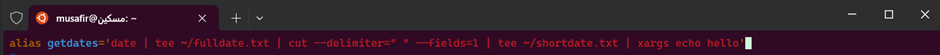
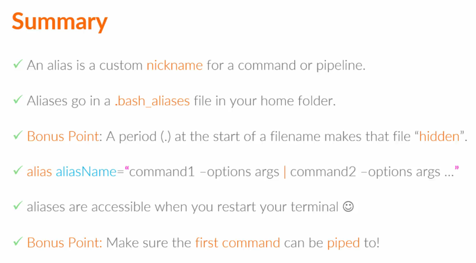

## Useful Linux Commands
1. `pwd`: Print working directory.
2. `cd`: Change directory.
3. `ls`: List files.
4. `mkdir`: Make directory.
5. `rm`: Remove files or directories.
6. `touch`: Create empty files.
7. `nano`: Text editor. exit=^x    save=y
8. `cat`: Concatenate and display files.
9. `cp`: Copy files or directories.
10. `whoami`: Print current user.
11. `id`: Print user identity.
12. `hostname`: Print system hostname.
13. `uptime`: Print system uptime.
14. `history`: Command history.
15. `tail`: Output the last part of files.
16. `head`: Output the first part of files.
17. `sudo su`: Switch user.
18. `useradd`: Add a new user.
19. `passwd`: Change user password.
20. `grep`: Search text.
21. `userdel`: Delete a user.
22. `groupadd`: Add a new group.
23. `groupmod`: Modify group attributes.
24. `groupdel`: Delete a group.
25. `usermod`: Modify user attributes. (-a -G) (-aG) [this and gpasswd do the same thing]
26. `gpasswd`: Modify group password. (-a) adds users to groups (-d) deletes (-M) set members separate the names with a comma (-A) set admin separate the names with a comma.
27. `mv`: Move or rename files.
28. `more`: Display file content page by page.
29. `less`: Display file content page by page (backward).
30. `hash`: Show history of programs and commands.
31. `cksum`: Verify file integrity.
32. `find`: Search for files.
33. `diff`: Compare files.
34. `ln`: Create file links.
35. `tar`: Archive files.
36. `gzip`: Compress files.
37. `zip`: Compress files (ZIP format).
38. `unzip`: Decompress files (ZIP format).
39. `chmod`: Change file permissions.
40. `chown`: Change file ownership.

## I/O Redirection Operators
- `>`: Sends output to a file.
- `<`: Receives input for a command from a file.
- `|`: Redirects output as input to another command.
- `>>`: Appends output to a file.
- `2>`: Redirects errors to a file.
- `2>>`: Appends errors to a file.

## From OverTheWire

- **find**: 
  - Example: `find /path/to/search -type f -size 1033c ! -executable -exec ls -lh {} +`
  - Description: Finds files within a specified path that meet certain criteria. In this example, it searches for files with exactly 1033 bytes (`-size 1033c`), are not executable (`! -executable`), and then executes `ls -lh` on each of them.

- **uniq**:
  - Description: Identifies duplicates of values in a file if they are adjacent to each other. 
  - Example: `sort <file> | uniq -u`
  - Description: Gets unique lines in the specified file after sorting it.

- **tr**:
  - Description: Translates or deletes characters. Commonly used for simple character transformations like ROT13 coding/decoding.
  - Example: `cat <file> | tr 'A-Za-z' 'N-ZA-Mn-za-m'`
  - Description: Converts characters in the file according to the specified transformation rule.

- **xxd -r**:
  - Description: Reverts a hexdump file back to its original form.

- **Common Decompression Methods**:
  - `gzip -d`: Decompresses files with a .gz extension.
  - `bzip2 -d`: Decompresses files with a .bz extension.
  - `tar -xf`: Extracts files with a .tar extension. It removes the .tar extension from the decompressed version.

- **nc (Netcat) Command**:
  - Description: A versatile networking utility used for reading from and writing to network connections using TCP or UDP protocols.
  - Example: `nc localhost 30000`
  - Description: Connects to port 30000 on the localhost using the Netcat utility, establishing a TCP connection to the specified port.

- **`openssl s_client -connect localhost:30001 -ign_eof`**:
  - Description: Establishes a secure connection to port 30001 on localhost using the OpenSSL s_client utility.
  - `openssl s_client`: Initiates a generic SSL/TLS connection to a remote host.
  - `-connect localhost:30001`: Specifies the host and port to connect to.
  - `-ign_eof`: Instructs OpenSSL to ignore an EOF from the input stream.

- **`nmap localhost -p 31000-32000`**:
  - Description: Scans to see what servers are open on ports 31000-32000.

- **Prior Command Execution Before SSH**:
  - Example: `ssh -p 2220 -l bandit18 bandit.labs.overthewire.org '<command>'`
  - Description: Executes a command from the terminal before SSHing into the server.
   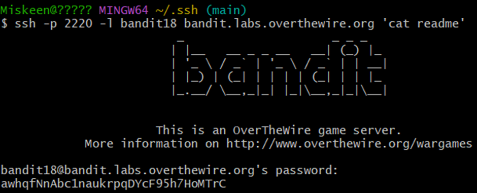

- **Utilizing Setuid Binary**:
  - Description: Execute the setuid binary in the home directory to identify its purpose and usage.
  - Example: `~/<binary-file-name>`
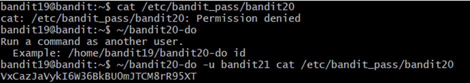

- **Command Execution with Netcat**:
  - Example: 
    ```bash
    echo "bandit20_password" | nc -l -p 12345 &  # Start a netcat listener on port 12345 as a subshell ( with &)
    ~/binary 12345                              # Execute the setuid binary, specifying port 12345
    ```
  - Description: Starts a netcat listener on port 12345 and executes the setuid binary with a specified port.
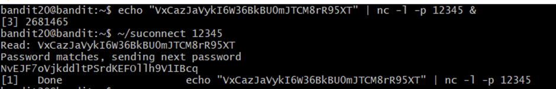

- **Brute-force Loop**:
  - Command: `for i in {0000..9999}; do echo bandit24_password $i; done | nc localhost 30002`
  - Brute-forces all possible 4-digit pincode combinations concatenated with the bandit24 password using netcat to find the correct pincode and retrieve the password for bandit25.

- **View Shells for Each Account**:
  - Command: `cat /etc/passwd`
  - Description: Displays the shells for each account on the system.

- **Interactive Mode with `more`**:
  - Description: Remains in interactive mode if all the contents haven’t filled your screen. 
   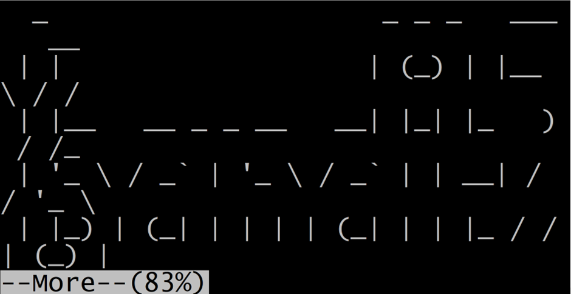
  - Press `v` to go into `vim` mode. In `vim`, you can execute shell commands with `:e`. For example, `:e /etc/bandit_pass/bandit26` retrieves the password.

- **Set Shell in Vim**:
  - Command: `:set shell=/bin/bash`
  - Description: Sets the shell in Vim, enabling the use of `:shell` to open a shell in that user.
  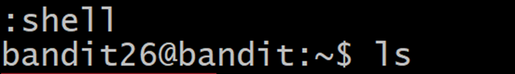 

- **Git Clone with Custom Port**:
  - Command: `git clone ssh://git@mydomain.example:[port]/gitolite-admin`
  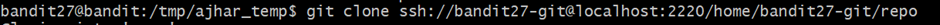 
  - Description: Clones a git repository with a custom port.

- **Navigate Git History**:
  - Command: 
    - `git log`: Displays all git commits.
    - `git checkout <commit_id>`: Moves to a previous commit.
    - `git branch -a`: Views all branches.
     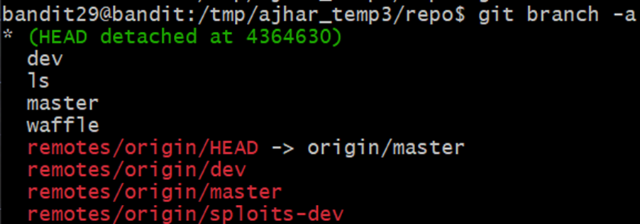

- **Tag Objects in Git**:
  - Command: `git tag`
  - Description: Tags git objects. Use `git show` to see different types of objects.
   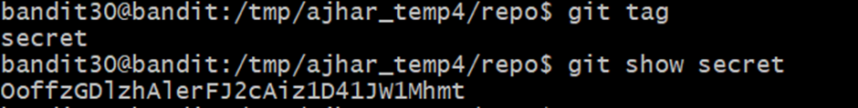

- **Linux Variable `$0`**:
  - Description: Represents the name of the currently executing script or program. Useful for referencing the script's name or determining how it was invoked.

- **Open New Shell with `$0`**:
  - Example: If stuck in a shell or binary, `$0` may open a new shell.
  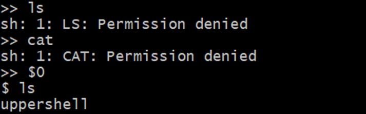 

- **Completed overthewire!!**:
 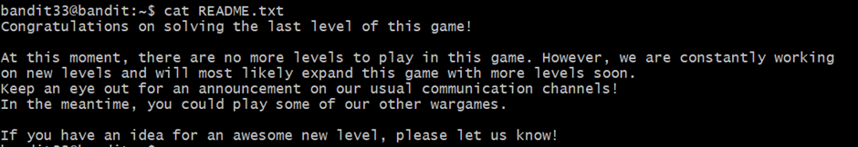

