# Terraform Notes

These are my notes for filling gaps in Terraform for the Hashicorp Terraform Associate 003 certification exam.

## Section 3 : Terraform State

- Terraform state: Used to correctly manage infrastructure resources.
  - `terraform show`: To see all created resources by Terraform (in state file).
  - `terraform state list`: List all resources in the state file.

## Section 4: Terraform Provisioners

- Provisioners:
  - Use "local-exec" to execute commands on the local machine.
  - Use "remote-exec" to execute commands on a remote machine.

## Section 5: Advanced Terraform Usage

1. **Terraform Format (`terraform fmt`):**
   - Useful for formatting Terraform configuration files.

2. **Terraform Taint (`terraform taint`):**
   - Recreates a resource in the next apply.
  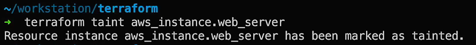
   - Used when encountering errors creating a resource properly.
   - Untaint to prevent resource recreation.
  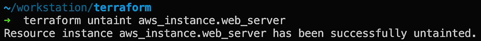
   - Deprecated; replaced with `terraform apply -replace=<resource-name>`.
  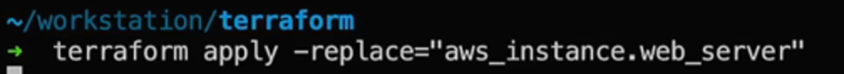 

3. **Terraform Import (`terraform import`):**
   - Adds resources created outside of Terraform into Terraform.
  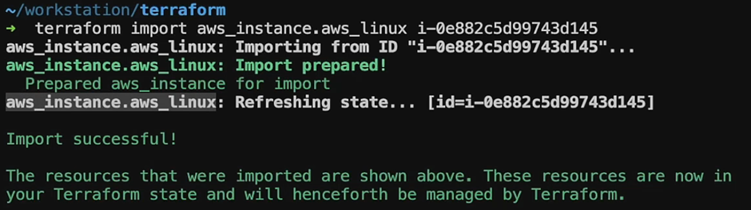
   - Requires writing Terraform configuration for the imported resource.
  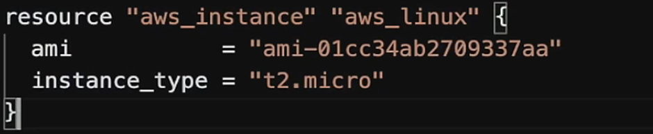
   - Check documentation on how to import a specific resource
  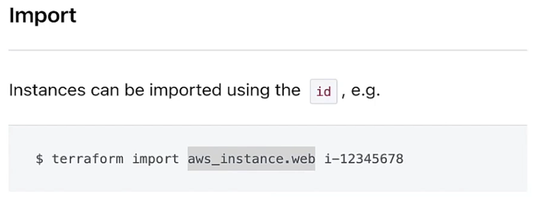

4. **Terraform Workspaces:**
   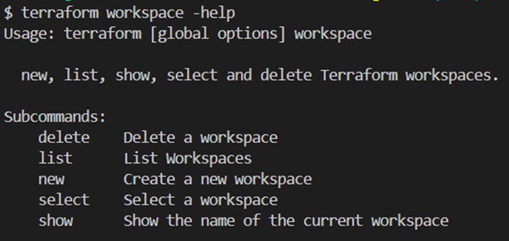
   - Allows creation of separate environments for managing resources.
   - Set to deploy into different availability zones or regions for environment separation.
   - Use `terraform.workspace` to reference the current workspace in configuration.
   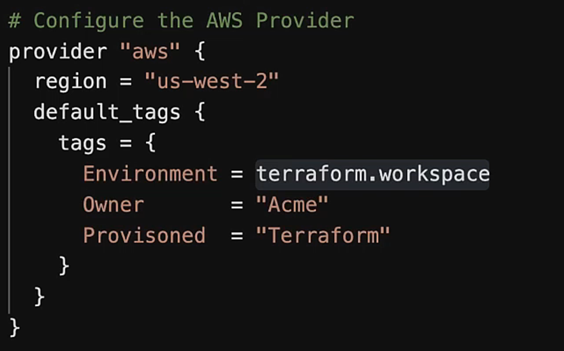

5. **Terraform State CLI:**
   - Use `terraform state show <resource name>` to view a specific resource in detail.

6. **Debugging Terraform:**
   - Enable detailed logs with `TF_LOG`.
     - Linux: `export TF_LOG=TRACE`
     - PowerShell: `$env:TF_LOG="TRACE"`
  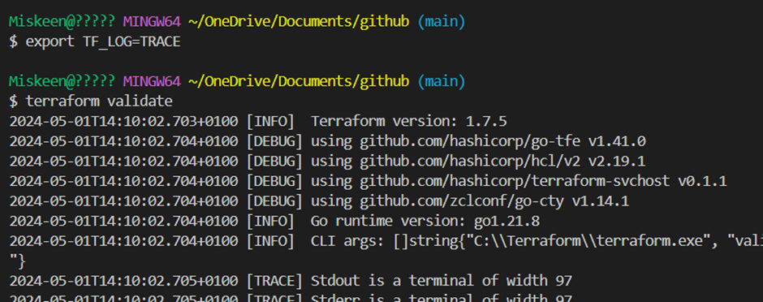
   - After enabling TF_LOG each terraform command now will show logs on everything happening in the background.
   - Set log path:
     - Linux: `export TF_LOG_PATH="terraform_log.txt"`
     - PowerShell: `$env:TF_LOG_PATH="terraform_log.txt"`
   - Disable logging:
     - Linux: `export TF_LOG=""`
     - PowerShell: `$env:TF_LOG=""`

## Section 6: Terraform Modules
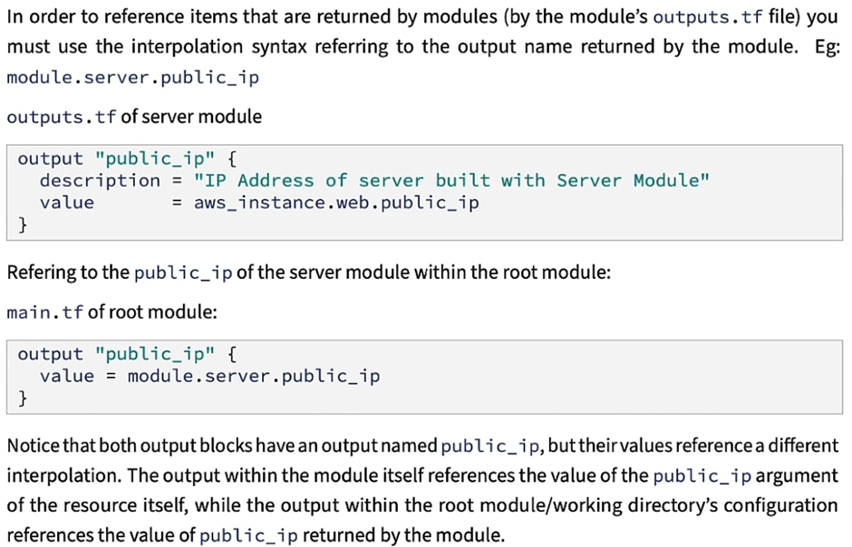
1. **Terraform Modules:**
   - Modular components used to encapsulate reusable infrastructure code.
   - Encourages best practices such as DRY (Don't Repeat Yourself) and separation of concerns.
   - Promotes code reusability and maintainability.

2. **Terraform Module Structure:**
   - Typically consists of main.tf, variables.tf, outputs.tf, and optionally provider.tf and versions.tf files.
   - main.tf: Defines resources and their configurations.
   - variables.tf: Declares input variables used within the module.
   - outputs.tf: Declares output values that can be accessed from other modules or Terraform configurations.

3. **Terraform Module Usage:**
   - Modules can be referenced within other Terraform configurations using the `module` block.
   - Input variables can be passed to modules using the `variables` block.
   - Output values from modules can be referenced using the `outputs` block.

4. **Terraform Registry:**
   - Official repository for sharing and discovering Terraform modules.
   - Hosts modules contributed by the community and verified by HashiCorp.
   - Allows easy integration of third-party modules into Terraform configurations.

## Section 7: Terraform Workflow

1. **Writing, Planning, and Applying:**
   - **Write:** Develop Terraform configurations using HashiCorp Configuration Language (HCL).
   - **Plan:** Generate an execution plan to preview changes before applying them.
   - **Apply:** Execute the plan to provision, modify, or destroy infrastructure resources.

2. **Viewing Providers:**
   - Use `terraform providers` to list all providers used in the Terraform configuration.
   - Provides information about the provider version, resource types, and data sources.

3. **Initializing Terraform:**
   - Use `terraform init` to initialize the working directory.
   - Downloads provider plugins and modules specified in the configuration.
   - Use `terraform init -upgrade` to update installed providers and modules to the latest versions.

4. **Changing Backend for State Management:**
   - Specify the backend configuration in the Terraform configuration.
  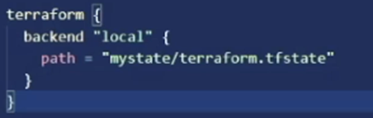
   - Use `terraform init -migrate-state` to migrate the state to the new backend.
   - This command moves the state file to the new directory as configured.

5. **Validating Terraform Configuration:**
   - Use `terraform validate` to check the syntax and internal consistency of the configuration.
   - Use `terraform validate -json` to output validation results in JSON format, useful for pipelines.
  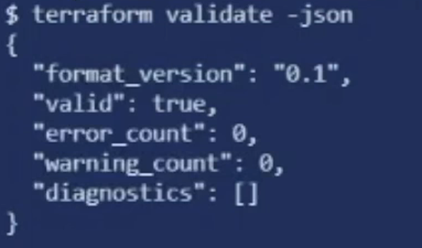

6. **Generating Execution Plan:**
   - Use `terraform plan` to create a dry-run execution plan.
   - Provides a preview of changes to be made, including additions, modifications, or deletions.
  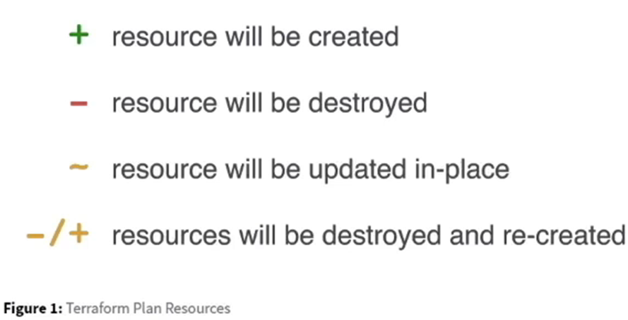
   - Use `terraform plan -refresh-only` to refresh the state and detect drift changes made manually.

7. **Applying Changes:**
   - Use `terraform apply` to execute the plan and apply changes to the infrastructure.
   - Save a plan with `terraform plan -out=myplan` and apply it automatically with `terraform apply myplan`.
   - `-auto-approve` flag skips the confirmation prompt during apply.

## Section 8: Terraform State Management

1. **Default Local Backend:**
   - Terraform stores state by default in a file named `terraform.tfstate` in the current working directory.
   
2. **State Locking:**
   - Terraform state locking prevents concurrent modifications to a single state file to prevent conflicts and data corruption.
  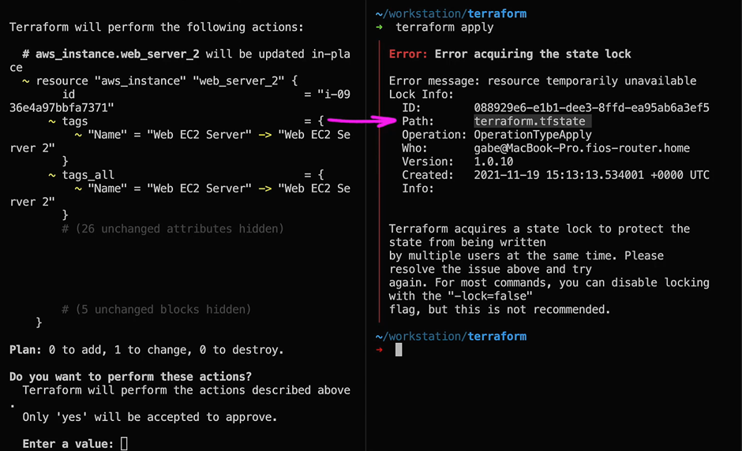
   - State backends that support statelocking are:
  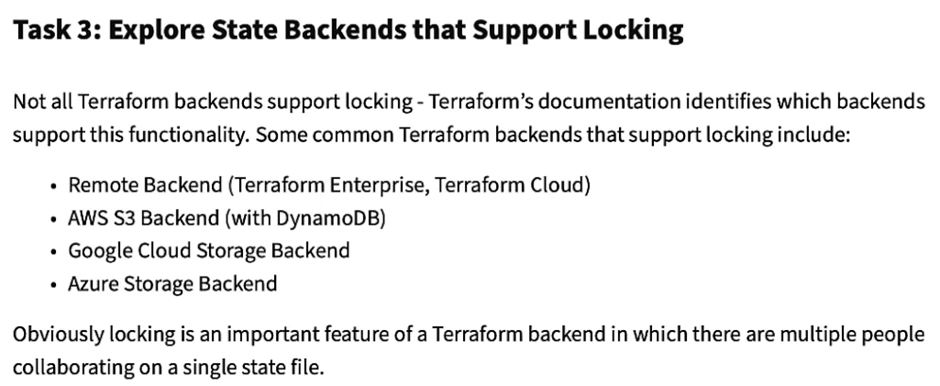

3. **Backend Authentication:**
   - Backend authentication is required when storing Terraform state to ensure secure access and operations.

4. **Backend Storage for State:**
   - **Standard Backends:** Support storage in cloud providers like AWS, GCP, and Azure.
  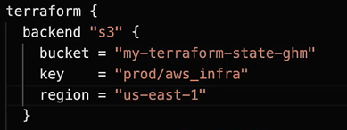
     - Enabling versioning is crucial for rollback capability.
     - Encryption enhances security for sensitive state files.
     - S3 lacks a locking mechanism, requiring DynamoDB for locking support.
     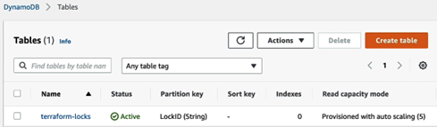 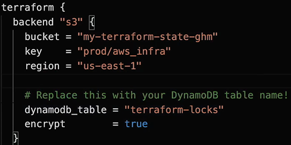

   - **Enhanced Backends:** Offer storage and operations, such as Terraform Cloud.
     - Commands are executed in the remote backend but displayed in the terminal
     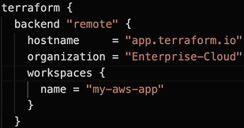
     - run `terraform init -reconfigure` to reconfigure a backend
     - Requires access keys/authentication.
     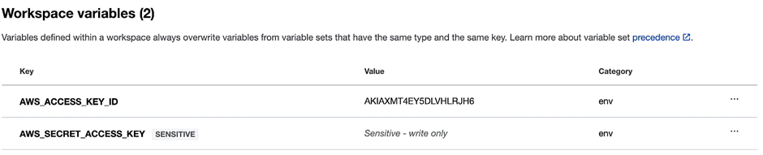

5. **State Migration:**
   - Use `terraform init -migrate-state` to migrate the state to a new backend or configuration.
   - Ensures seamless transition of state management.
    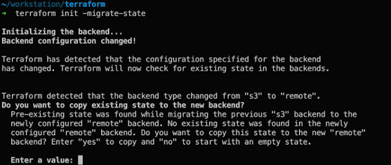

6. **Refreshing State:**
   - `terraform refresh` is like `terraform plan -refresh-only` and helps detect configuration drift, you will need to update terraform configuration if you want to keep changes otherwise it will correct any changes made outside of terraform. `terraform apply -refresh-only` will update the state file NOT the terraform config files so you need to change to keep changes in further apply executions.`terraform apply -refresh-only` will update the state file NOT the terraform config files so you need to change them as well to keep changes in further apply executions.

7. **Terraform Backend Configuration:**
   - Specify backend configuration using `-backend-config` during initialization.
   - Example: `terraform init -backend-config="path=state_data/terraform.prod.tfstate" -migrate-state`

6. **Sensitive Data in Terraform State:**
   - Use the `sensitive` attribute to hide sensitive values in logs and outputs.
   - Although hidden, sensitive data still appears in the state file, so ensure its protection.
    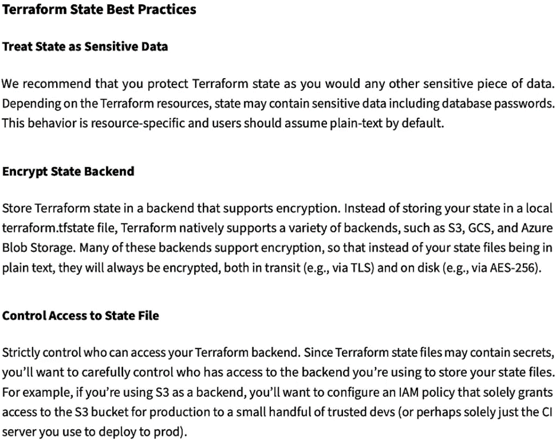

## Section 9: Terraform Advanced Concepts

1. **Local Values:**
   - Local values simplify Terraform configuration and reduce repetition.
    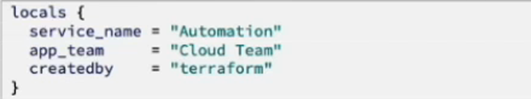
   - Use them sparingly, typically when a single value is used across multiple places and likely to change.
   - Commonly used with tags for consistent resource tagging.
    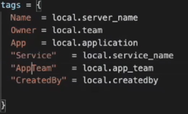
   - Example: `local.commontags` can be referenced in any resource block to maintain consistent tags.
    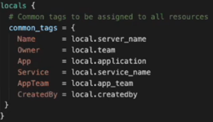
    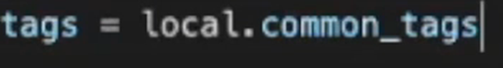

2. **Input Variables:**
   - Input variables are essential to avoid hardcoding values.
    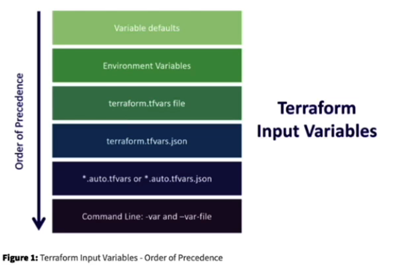
   - Declare variables in `variables.tf` and set values in `terraform.tfvars` files to prevent constant modifications.
    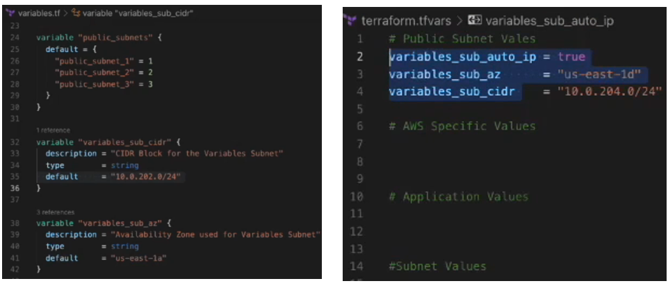
   
3. **Outputs:**
   - Reference outputs in the CLI using `$(terraform output -raw <output name>)`.
    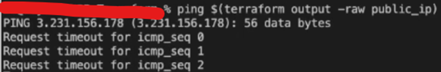 - the lower(var.cloud) in the first validation block is referencing the variable defined to compare with the condition, so here its cloud because we haven’t set a value except after running the plan.
   
4. **Variable Validation and Suppression:**
   - **Validation:** Useful for modules and ensuring correct inputs.
     - Include a `validation` block with `condition` and `error_message` arguments.
      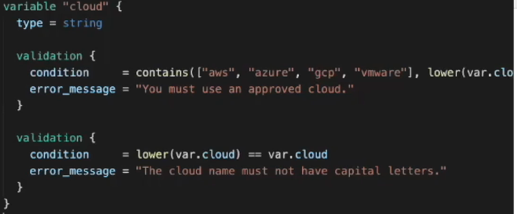
   - **Suppression:**
     - Mark variables as `sensitive=true` to prevent their output 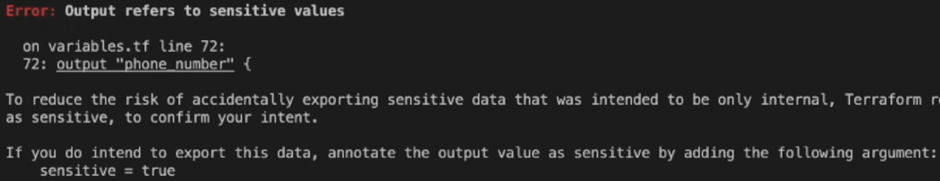
     - Unless marked sensitive in the output block as well.
      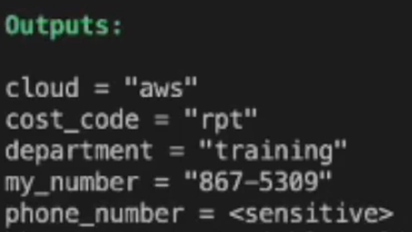

5. **Secure Secrets:**
   - Avoid storing secrets in plain text.
   - Use `sensitive` configuration for sensitive data.
   - Utilize environment variables:
     - In local Terraform: `export TF_VAR_<variable-name>=<variable_value>`
     - In Terraform Cloud GUI: Enter `Key: TF_VAR_<variable-name>`, Value: `<variable_value>`
   - Leverage secret stores like Vault or AWS Secret Manager for enhanced security.
    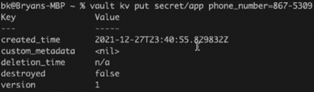
   - Connect to vault and call in terraform.
    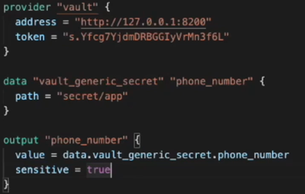

6. **Collection and Structure Types:**
   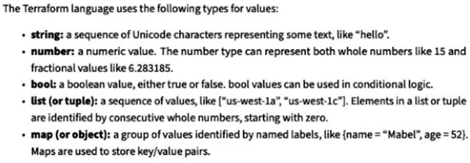
   - Define useful variables such as `env` for dynamic referencing of environment-specific values in resource blocks.
    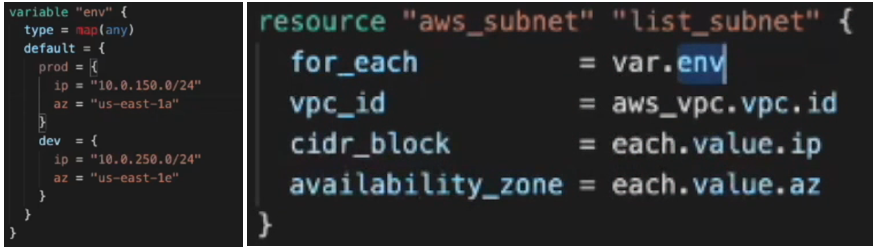

7. **Data Blocks:**
   - Terraform uses data sources to fetch information from cloud provider APIs or outputs of other Terraform configurations.
   - Called using the convention `data.<resource_name>.<attribute_reference>`.

8. **Built-in Functions:**
   - Used in expressions to transform and combine values to meet specific requirements.
    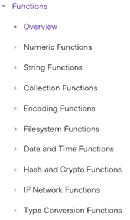

9.  **Dynamic Blocks:**
   - Similar to `for` expressions but produce nested blocks instead of complex typed values.

10. **Terraform Graph:**
    - Generates a graph of resources using `terraform graph`.
    - Useful for visualizing resource dependencies and relationships.

11. **Terraform Resource Lifecycle:**
    - `create_before_destroy`: Creates a new resource before deleting the existing one.
     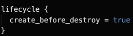
    - `prevent_destroy`: Prevents Terraform from destroying a resource if set to true.

## Section 10: Terraform Cloud

1. **Terraform Cloud Workspaces:**
   - Terraform Cloud workspaces function similarly to local Terraform CLI workspaces but offer additional features.
   - Workspaces store state data, have their own variable values and environment variables, and enable remote operations and logging.
   - They provide access controls, version control integration, API access, and policy management.
   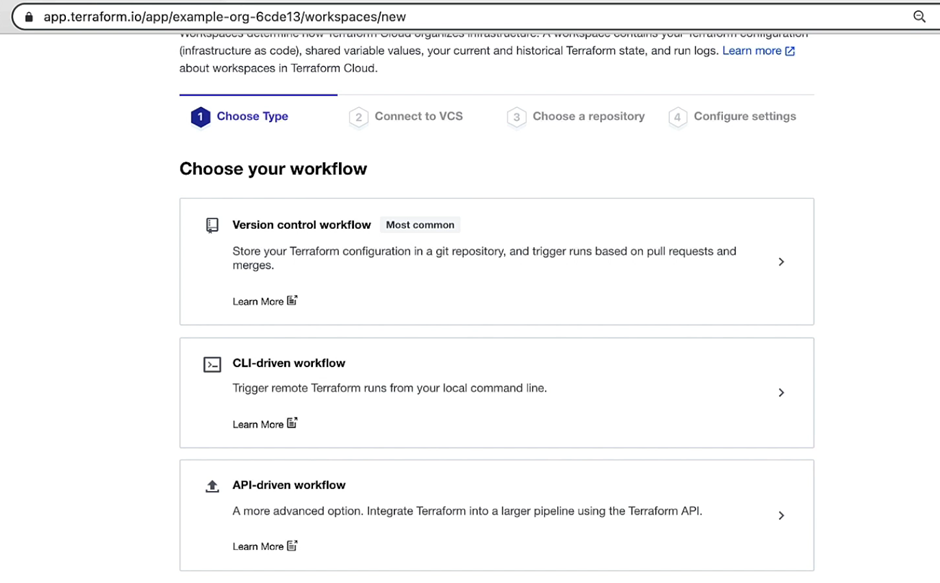
   - Here is picture on how you would using the same code deploy infrastructure In different environments with their own state in terraform cloud 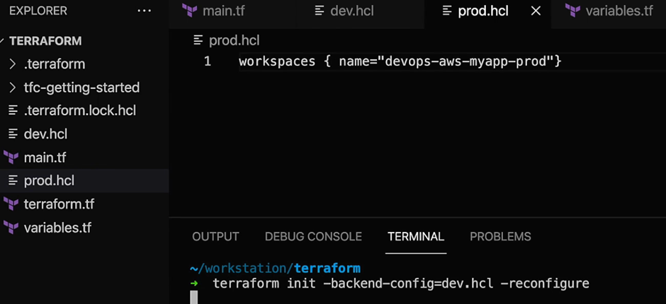
   - What to put in a workspace?
    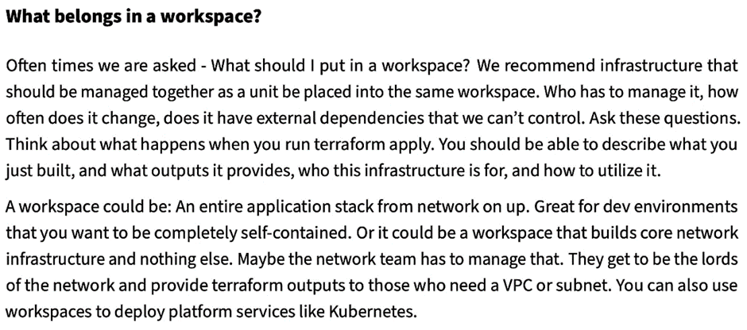

2. **Variables:**
   - Terraform Cloud introduces `Variable Sets`, allowing reuse of variables across multiple workspaces.
   - It's recommended to create a variable set for variables used in multiple workspaces.

3. **Version Control Integration:**
   - Terraform Cloud supports integration with version control systems like GitHub, GitLab, Bitbucket, and Azure DevOps.

4. **Private Module Registry:**
   - Modules can be utilized in Terraform Cloud and should be named as `terraform-<provider>-<name>`.
    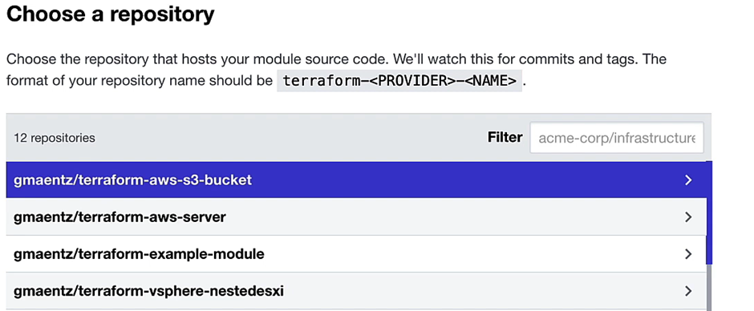

5. **Sentinel Policy:**
   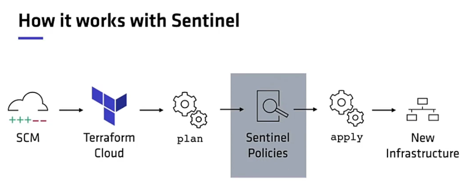
   - Enables users to implement policy-as-code for enforcing guardrails around resources.
   - Sentinel runs between the `terraform plan` and `apply` stages of the workflow.
   - Policies can be grouped in a Sentinel policy set with enforcement levels.
    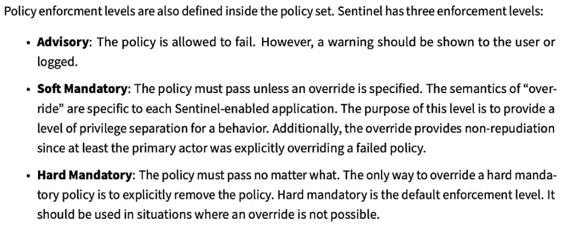

6. **Terraform Cloud VCS Workflow:**
   - Requires a version control repository, associating the workspace with the repo.
   - Every committed code push triggers a Terraform plan on Terraform Cloud.
   - Terraform apply cannot be executed locally until changes are committed to the repository.
   - Merging the development branch to the production branch via pull request triggers a plan in the production workspace.

7. **Additional Regions:**
   - Utilize another provider block with an alias to deploy resources in different regions.
   - The alias can then be specified in resources for deployment in the desired region.
